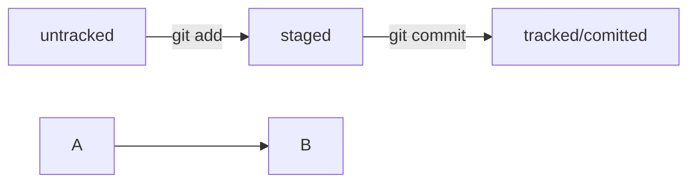

# Шпаргалка markdown

## Выделение текста

Вы можете выделять текст в markdown с помощью символов `_` или `*`. Например:

Пример _курсива_ и **жирного** текста.

## Заголовки

Заголовки можно создавать с помощью символа `#`. Чем больше `#`, тем меньше заголовок. Например:

# Заголовок первого уровня
## Заголовок второго уровня
### Заголовок третьего уровня

## Выделение кода

Чтобы выделить текст как код, поместите его в тройные кавычки `````. 

```
mkdir my_project
cd my_project
git init
```
Это лишь некоторые функции markdown.


---
- --amend рассчитан на работу с последним коммитом (HEAD).
- Дополнить коммит новыми файлами можно с помощью git commit --amend --no-edit. Благодаря опции --no-edit сообщение к коммиту останется таким, каким и было.
- Изменить сообщение к коммиту позволяет команда git commit --amend -m "Обновлённое сообщение коммита".
---
- Команда git restore --staged <file> переведёт файл из staged обратно в modified или untracked.
- Команда git reset --hard <commit hash> «откатит» историю до коммита с хешем <hash>. Более поздние коммиты потеряются!
- Команда git restore <file> «откатит» изменения в файле до последней сохранённой (в коммите или в staging) версии.
---
Теперь вы можете просматривать изменения в файлах:
- Команда git diff сравнит последнюю закоммиченную версию файла с той, что находится в состоянии modified.
- Команда git diff --staged покажет изменения в staged-файлах относительно последних закоммиченных версий.
---
Игнорирование файлов — механизм, который нельзя игнорировать. Вот что важно помнить:
Если нужно, чтобы Git игнорировал какие-то файлы, стоит составить файл .gitignore.
-Посмотреть, что игнорируется, можно с помощью команды git status --ignored.
-Сам файл .gitignore — это обычный файл в репозитории. Его тоже стоит закоммитить.
-Шаблонов много, но их легко найти в интернете вместе с примерами использования.
---
Шпаргалка. Начало работы с Git
Чтобы вам было проще запомнить все команды, о которых шла речь в этом модуле, мы собрали их в одном месте.
Инициализация репозитория
git init (от англ. initialize, «инициализировать») — инициализируй репозиторий.
Синхронизация локального и удалённого репозиториев
git remote add origin https://github.com/YandexPracticum/first-project.git (от англ. remote, «удалённый» + add, «добавить») — привяжи локальный репозиторий к удалённому с URL https://github.com/YandexPracticum/first-project.git;
git remote -v (от англ. verbose, «подробный») — проверь, что репозитории действительно связались;
git push -u origin main (от англ. push, «толкать») — в первый раз загрузи все коммиты из локального репозитория в удалённый с названием origin.
💡 Ваша ветка может называться master, а не main. Подправьте команду, если это необходимо.
git push (от англ. push, «толкать») — загрузи коммиты в удалённый репозиторий после того, как он был привязан с помощью флага -u.
Подготовка файла к коммиту
git add todo.txt (от англ. add, «добавить») — подготовь файл todo.txt к коммиту;
git add --all (от англ. add, «добавить» + all, «всё») — подготовь к коммиту сразу все файлы, в которых были изменения, и все новые файлы;
git add . — подготовь к коммиту текущую папку и все файлы в ней.
Создание и публикация коммита
git commit -m "Комментарий к коммиту." (от англ. commit, «совершать», фиксировать» + message, «сообщение») — сделай коммит и оставь комментарий, чтобы было проще понять, какие изменения сделаны;
git push (от англ. push, «толкать») — добавь изменения в удалённый репозиторий.
Просмотр информации о коммитах
git log (от англ. log, «журнал [записей]») — выведи подробную историю коммитов;
git log --oneline (от англ. log, «журнал [записей]» + oneline, «одной строкой») — покажи краткую информацию о коммитах: сокращённый хеш и сообщение.
Просмотр состояния файлов
git status (от англ. status, «статус», «состояние») — покажи текущее состояние репозитория.
Добавление изменений в последний коммит
git commit --amend --no-edit (от англ. amend, «исправить») — добавь изменения к последнему коммиту и оставь сообщение прежним;
git commit --amend -m "Новое сообщение" — измени сообщение к последнему коммиту на Новое сообщение.
💡 Выйти из редактора Vim: нажать Esc, ввести :qa!, нажать Enter.
«Откат» файлов и коммитов
git restore --staged hello.txt (от англ. restore, «восстановить») — переведи файл hello.txt из состояния staged обратно в untracked или modified;
git restore hello.txt — верни файл hello.txt к последней версии, которая была сохранена через git commit или git add;
git reset --hard b576d89 (от англ. reset, «сброс», «обнуление» + hard, «суровый») — удали все незакоммиченные изменения из staging и «рабочей зоны» вплоть до указанного коммита.
Просмотр изменений
git diff (от англ. difference, «отличие», «разница») — покажи изменения в «рабочей зоне», то есть в modified-файлах;
git diff a9928ab 11bada1 — выведи разницу между двумя коммитами;
git diff --staged — покажи изменения, которые добавлены в staged-файлах.