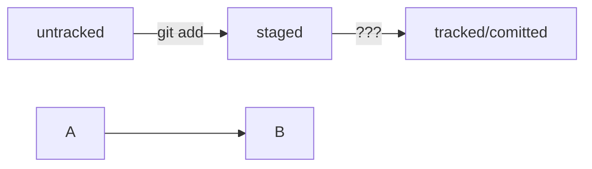

# Шпаргалка markdown

## Выделение текста

Вы можете выделять текст в markdown с помощью символов `_` или `*`. Например:

Пример _курсива_ и **жирного** текста.

## Заголовки

Заголовки можно создавать с помощью символа `#`. Чем больше `#`, тем меньше заголовок. Например:

# Заголовок первого уровня
## Заголовок второго уровня
### Заголовок третьего уровня

## Выделение кода

Чтобы выделить текст как код, поместите его в тройные кавычки `````. 

```
mkdir my_project
cd my_project
git init
```
Это лишь некоторые функции markdown.



- --amend рассчитан на работу с последним коммитом (HEAD).
- Дополнить коммит новыми файлами можно с помощью git commit --amend --no-edit. Благодаря опции --no-edit сообщение к коммиту останется таким, каким и было.
- Изменить сообщение к коммиту позволяет команда git commit --amend -m "Обновлённое сообщение коммита".